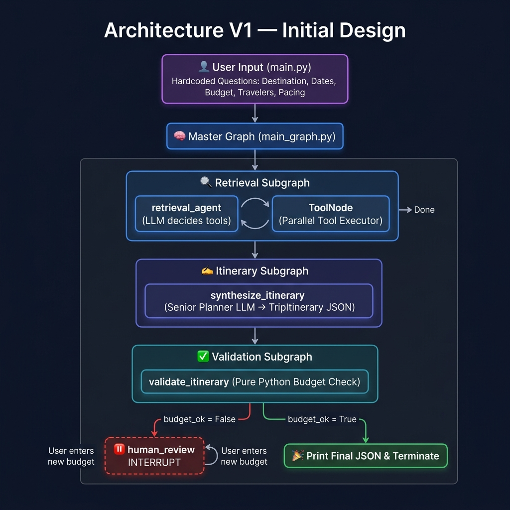
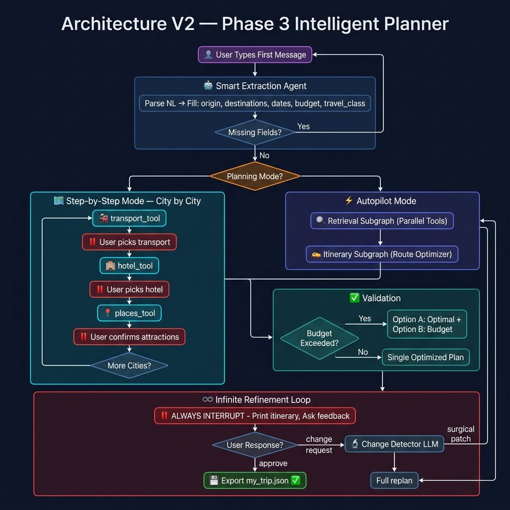
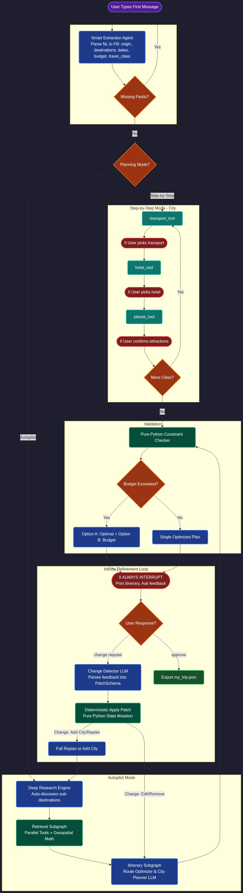
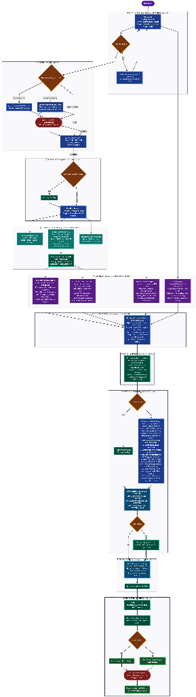

# AI Travel Planner — Complete Project Documentation

> This document is the single source of truth for the entire project journey.
> It covers the initial architecture, all bug fixes applied, all feature upgrades made,
> and the full Phase 3 roadmap with versioned graph structures.

---

## Table of Contents
1. [Phase 1 — V1 Architecture](#phase-1--v1-architecture)
2. [Graph Structure — Version 1](#graph-structure--version-1-initial)
3. [Phase 2 — Bug Fixes & Incremental Upgrades](#phase-2--bug-fixes--incremental-upgrades)
4. [Phase 3 — The Intelligent Planner Roadmap](#phase-3--the-intelligent-planner-roadmap)
5. [Graph Structure — Version 2](#graph-structure--version-2-phase-3)
6. [Phase 7 & 8 — Deep Research & Deterministic Patching](#11-phase-7-deep-research--geospatial-enrichment)
7. [Graph Structure — Version 3](#graph-structure--version-3-phase-8-master-graph)
8. [Source File Reference](#source-file-reference)
9. [Phase 13 — Token Crisis & Multi-Model Architecture](#phase-13--the-token-crisis--multi-model-architecture)
10. [Phase 14 — Scoring Intelligence & Itinerary Quality](#phase-14--scoring-intelligence--itinerary-quality)
11. [Graph Structure — Version 4](#graph-structure--version-4-phase-14-full-pipeline)


---

## Phase 1 — V1 Architecture

### Goal
Build a terminal-based AI Travel Planner powered by LangGraph. The agent accepts a destination and budget from the user, fetches live web data via tools, and returns a structured JSON itinerary.

### Design Decisions
| Decision | Rationale |
|---|---|
| **LangGraph** | Enables stateful, multi-step AI workflows with HITL (Human-in-the-Loop) support |
| **Groq (Llama 3.3 70B)** | Extremely fast, free-tier LLM ideal for parallel tool-calling |
| **SQLite Checkpointer** | Persists agent memory between runs, enabling pause/resume |
| **Pydantic Structured Output** | Forces the LLM to produce validated, schema-compliant JSON |
| **DuckDuckGo Search** | Free, no-API-key web search for transport, weather, and hotel data |
| **Foursquare API** | Reliable POI and hotel search with structured location data |

### Components Built
| Component | File | Purpose |
|---|---|---|
| State | `src/state/trip_state.py` | Shared `TypedDict` memory flowing through all nodes |
| Schema | `src/schemas/trip_schema.py` | Pydantic `TripItinerary` model for structured JSON output |
| Transport Tool | `src/tools/transport_tool.py` | DuckDuckGo search for multi-modal transport options |
| Hotel Tool | `src/tools/hotel_tool.py` | Foursquare API for hotel listings |
| Places Tool | `src/tools/places_tool.py` | Foursquare API for attractions and dining |
| Weather Tool | `src/tools/weather_tool.py` | DuckDuckGo web search for weather/climate data |
| Retrieval Subgraph | `src/graphs/retrieval_subgraph.py` | LLM orchestrator that fires tools in parallel |
| Itinerary Subgraph | `src/graphs/itinerary_subgraph.py` | Senior Planner LLM that synthesizes raw data into JSON |
| Validation Subgraph | `src/graphs/validation_subgraph.py` | Pure-Python budget constraint checker |
| Main Graph | `src/graphs/main_graph.py` | Master orchestrator with SQLite memory and HITL interrupt |
| CLI | `main.py` | Terminal entry point |

---

## Graph Structure — Version 1 (Initial)




### V1 Limitations Identified
- ❌ Origin city treated as a vacation destination (hotels + sightseeing planned for Kolkata)
- ❌ Hardcoded `input()` questions — re-asks info user already provided
- ❌ Date Assistant didn't exist — dates were a simple `input()` with no intelligence
- ❌ Itinerary LLM didn't receive the actual travel dates — used generic durations
- ❌ LLM could get stuck in infinite tool-calling loop (hallucination bug)
- ❌ Hardcoded Session ID caused memory corruption between runs
- ❌ No transport class preference (AC, Sleeper, Economy, Business)
- ❌ No alternative route or budget comparison options
- ❌ Agent terminates immediately after printing JSON — no iteration
- ❌ Any change request triggered a full pipeline re-run

---

## Phase 2 — Bug Fixes & Incremental Upgrades

### Bug Fix 1 — `duckduckgo_search` → `ddgs` Migration
**Root Cause:** The `duckduckgo_search` package was renamed to `ddgs` by its author.
**Fix:** Installed `ddgs` via pip. Updated imports in `transport_tool.py` and `weather_tool.py`.

---

### Bug Fix 2 — `SqliteSaver` Invalid Checkpointer
**Root Cause:** `SqliteSaver` was passed a connection string, but requires a live `sqlite3.connect()` object.
**Fix:** Updated `main_graph.py`:
```python
conn = sqlite3.connect("trip_memory.db", check_same_thread=False)
checkpointer = SqliteSaver(conn)
```

---

### Bug Fix 3 — Infinite Tool-Calling Hallucination Loop
**Root Cause:** After receiving 15 tool results, the LLM got confused and tried calling tools again with broken XML-like syntax, crashing the pipeline.
**Fix:** Added an explicit stop instruction to `retrieval_subgraph.py` system prompt:
> *"You MUST only call tools ONCE. If you see ToolMessage responses, do NOT call more tools. Output 'Data retrieved.' and stop."*

---

### Bug Fix 4 — Memory Corruption (`$0.0` Budget Bug)
**Root Cause:** Hardcoded `thread_id = "trip_session_1"` meant crashed sessions left corrupt memory that was silently loaded on every subsequent run.
**Fix:** Updated `main.py` to generate a unique UUID session ID every run:
```python
import uuid
session_id = uuid.uuid4().hex
config = {"configurable": {"thread_id": session_id}}
```

---

### Upgrade 1 — Interactive Date Assistant
**Problem:** Users asking *"when is the best time to visit?"* received no response.
**Solution:** Replaced the simple `input()` for dates with a conversational LLM loop:
- Parses natural language via `messages = [("system", ...), ("human", user_input)]`
- Detects `DATES:` vs `ADVICE:` in the LLM response
- If advice: prints the recommendation and re-asks
- If dates: locks them in and continues

---

### Upgrade 2 — Date-Aware Itinerary Synthesis
**Problem:** Itinerary LLM (using small 8B model) generated 10-day plans for 15-day trips.
**Solution:** 
- Upgraded `itinerary_subgraph.py` to `llama-3.3-70b-versatile`
- Injected `user_request` (containing the full date range) directly into the Itinerary Planner system prompt

---

## Phase 3 — The Intelligent Planner Roadmap

### 1. Origin vs Destination Separation
`TripState` will track `origin_city` and `destination_cities` as separate fields. LLM prompts will explicitly forbid hotel stays or day-plans for the origin city.

### 2. Smart Extraction (Dynamic Onboarding)
Replace hardcoded `input()` with a **Smart Extraction LLM**:
- Parses the user's first natural language message into a Pydantic model
- Identifies which required fields (origin, destinations, dates, budget, travelers, pacing, travel class) are `None`
- Asks **only** the missing questions conversationally
- Boots up the LangGraph pipeline once all fields are populated

### 3. Granular Transport Preferences
`travel_class` becomes a required field:
- **Train:** Sleeper | AC 3 Tier | AC 2 Tier | AC 1st Class
- **Flight:** Economy | Business | First Class

Injected into the `transport_tool` prompt to filter and price accordingly.

### 4. Multi-Option Proposals & Route Optimization
- Agent computes the geographically optimal city sequence to minimize travel time
- When calculated budget exceeds the user's max: generates **Option A** (Optimal) + **Option B** (Budget)
- When within budget: generates a single optimized plan

### 5. Surgical Patch Edits (Smart Change Detection)
A **Change Detector LLM** parses user feedback into a `PatchRequest` that tells the graph exactly what to fix and the minimum set of tools to re-run.

**Routing Matrix:**
| Change Type | What Re-Runs |
|---|---|
| `hotel_change` | `hotel_tool(city)` (1 tool) |
| `transport_change` | `transport_tool(prev_city → city)` (1 tool) |
| `add_city` | ALL tools for new city + 2 adjacent transport legs |
| `remove_city` | 1 transport leg recalculation |
| `origin_change` | `transport_tool(new_origin → first_city)` (1 tool) |
| `traveler_change` | Recalculate budget + re-run transport pricing |
| `reorder_cities` | Recalculate 2 adjacent transport legs only |
| `full_replan` | Full retrieval pipeline from scratch |

### 6. Planning Mode Selection
At session start, the user picks:
| Mode | Behavior |
|---|---|
| **[A] Autopilot** | AI plans everything → user reviews at the end → iterate if needed |
| **[B] Step-by-Step** | City-by-city: user picks transport → hotel → attractions for each city before moving on |

### 7. Infinite Refinement Loop
The agent never terminates until the user types `approve`:
1. Itinerary printed → agent asks for feedback
2. Feedback → Change Detector → Surgical patch OR full re-plan
3. Loop continues → on `approve`, exports `my_trip_YYYY.json`

### 8. Phase 4: Hyper-Realistic Time & Delay Management
The agent goes beyond high-level daily plans by implementing strict time-of-day awareness:
1. **Dynamic Rest Blocks:** Calculates true arrival time. For elderly travelers, it strictly allocates a 5-6 hour block of `rest_hours_allocated` immediately following travel. For young adults, it allocates 3-4 hours.
2. **Time-of-Day Scheduling:** The daily plan is broken into a `schedule_breakdown` dictionary (`Morning`, `Afternoon`, `Evening`). If the post-travel rest block pushes into the evening, the agent ONLY schedules a light walking tour or nearby dinner. If arrival is at night, the entire day is blocked for rest.
3. **Delay Calculation Buffers:** The transport tool explicitly searches for historical average delays. The agent computes an `estimated_delay_buffer_hours` (minimum 2 hours for trains, 1 hour for flights) and adds this to the theoretical arrival time before scheduling any downstream activities.

### 9. Phase 5: Localization & Terminal UX
1. **Localization:** The internal schema replaces all USD references with `INR (₹)`, mapping user budgets strictly to Rupees.
2. **Terminal UI:** The `main.py` entrypoint leverages the `rich` Python library to parse the raw JSON generated by the agent and print a color-coded, heavily formatted visual itinerary for easy reading.

### 10. Phase 6: Time Geometry & Auto-Expansion
1. **Dynamic Route Curation:** The `smart_extraction` node uses a 70B model to dynamically evaluate the user's requested timeframe. If a user asks for 14 days in a single city, the LLM intercepts this and auto-expands `destination_cities` to include nearby hubs (e.g., Agra, Jaipur) to ensure a realistic geographic route.
2. **Time Geometry:** The Senior Route Optimizer explicitly calculates long-haul transport times (> 12 hours) and physically consumes those days from the total trip duration by blocking out entire `DayPlan` objects as "In Transit", correctly shrinking the available sightseeing window.

---

## Graph Structure — Version 2 (Phase 3)



---

### 11. Phase 7: Deep Research & Geospatial Enrichment
1. **Deep Research Engine:** Replaced simple origin/destination routing with an autonomous Deep Research stage. If a user asks for a broad state (like "West Bengal") or has a massive trip duration (e.g. 20 days), DuckDuckGo automatically discovers sub-destinations (Digha, Darjeeling) to prevent place starvation and hallucination in a single city.
2. **Geospatial Enrichment Engine (Math + Logic):** Replaced LLM spatial hallucination with pure Python math. The `places_tool` hits the OpenStreetMap (Nominatim) API to fetch exact Lat/Lon coordinates for every attraction. It then calculates a Haversine Distance matrix and attaches a `nearby_places` field to the raw JSON. The City Planner LLM uses its intelligence to estimate time, but is forced to use the algorithmic `nearby_places` to group attractions minimizing transit time.

### 12. Phase 8: Deterministic Patching Architecture (Logic over Prompts)
**Problem:** The `surgical_patch_agent` was an LLM tasked with patching user itineraries. It suffered from logic failure (unable to delete cities, duplicated hotels instead of overriding them, failed to mutate traveler profiles).
**Solution:** Deleted the prompt-based `surgical_patch_agent`. Replaced it with a deterministic pure-Python `apply_patch` node that explicitly mutates the `TripState` (`destination_cities`, `traveler_profile`, `user_selections`) before routing back to synthesis. 

### 13. Phase 9: Architecture V4 & Smart Intent Classification
1. **Universal Parameter Patching (V4):** Upgraded `PatchRequest` schema to support `parameter_changes`, allowing the user to dynamically mutate global `TripState` variables (budget, pacing, duration, modes) mid-flight without breaking the loop.
2. **Relative Datetime Injection:** Smart Extraction now injects the current Python `datetime` into the system rules, allowing the LLM to successfully parse relative time phrases (e.g., "next month") directly into the Pydantic schema without hallucinating or dropping inputs.
3. **AI Intent Classification (UX):** Removed brittle Regex keyword matching from the terminal loop. Implemented a lightweight Pydantic `UserIntent` classifier (`SELECTION_ONLY`, `QUESTION`, `REQUEST_MORE`) to instantly parse natural language inputs during destination curation.

### 14. Phase 10: Granular Day Planning & Error Resilience
1. **Destination Feasibility Checker:** AI validation loop *before* routing. Warns users if they pack too many cities into too few days, opening an interactive loop to drop/replace cities or fetch time-appropriate alternatives.
2. **Isolated 'Show More Options' Views:** Terminal UX upgrade to strictly render new destinations in isolated tables rather than appending to an endless list.
3. **Heavy LLM Fallback Generation:** Rate limit resilience in `itinerary_subgraph.py`. If a city fails to plan due to API token limits (e.g., Groq 429 Error), the Python stitcher will explicitly construct a generic `CityStop` preserving the allocated nights to ensure global trip duration math remains intact.
4. **Day-wise Plan Redesign:** Refactoring `DayPlan` schemas from rigid 3-block templates (Morning/Midday/Afternoon) into highly granular, chronological itineraries (6-10 items per day) with exact activity types and rich descriptive narratives.

### 15. Phase 11: Prompt Centralization & Smart Intelligence
1. **Centralized Prompt Registry:** Migrated all inline string prompts from across the codebase into a single `src/prompts.py` module containing 12+ highly-engineered prompt constructors. Eliminates prompt sprawl and prevents prompt desync between subgraphs.
2. **Smart Destination Intelligence:** Upgraded Deep Research engine (`V5`) with cognitive filters:
   - **Cluster Detection:** Automatically detects overlapping destinations (e.g., Mathura + Vrindavan) and merges them to prevent itinerary duplication.
   - **Landmark Injection:** Forces the LLM to output a tier-1 landmark (e.g., Taj Mahal for Agra) for every destination pitch, significantly improving the curation UI.

### 16. Phase 12: UX Polish & Single Plan Rendering
1. **Budget Banner Replace Dual-Option:** Removed the rigid Option A / Option B dual-rendering (which often hallucinated duplicate plans). Instead, the engine outputs a single optimal route and appends a color-coded budget status banner (Green for under budget, Red for over budget) to visually guide the user.
2. **Origin Deduplication:** Added Pure Python logic to aggressively strip the origin city AND deduplicate allocations to prevent the LLM from adding the start/end city twice during round-trip routing.

---

## Graph Structure — Version 3 (Phase 8 Master Graph)



---

## Source File Reference

### State Management (`src/state/`)
- **`trip_state.py`** — The `TripState` TypedDict. Shared memory flowing through all nodes. Uses `Annotated[List, add_messages]` for parallel tool results.

### Schemas (`src/schemas/`)
- **`trip_schema.py`** — Pydantic models. `TripItinerary` → `RouteCity` → `DayPlan` → `Hotel` → `TransportOption`. Used with `.with_structured_output()` to guarantee valid JSON.

### Tools (`src/tools/`)
- **`transport_tool.py`** — DuckDuckGo search for multi-modal transport. Returns raw web snippets for LLM parsing.
- **`hotel_tool.py`** — Foursquare Places API (category `19014`). Returns name, address, rating, price tier.
- **`places_tool.py`** — Foursquare Places API + Nominatim OpenStreetMap for Geospatial Enrichment.
- **`weather_tool.py`** — DuckDuckGo search for weather/climate. Works for future dates via historical averages.

### Graphs (`src/graphs/`)
- **`retrieval_subgraph.py`** — LLM orchestrator. Injects today's date to prevent hallucination. Uses LangGraph `ToolNode` for parallel tool execution.
- **`itinerary_subgraph.py`** — Senior Planner LLM. Reads raw tool data, applies constraints, outputs structured `TripItinerary` JSON.
- **`validation_subgraph.py`** — Pure-Python constraint checker. Validates budget without LLM overhead.
- **`main_graph.py`** — Master orchestrator. Connects all subgraphs. Manages `SqliteSaver` checkpointing, deterministic patching, and HITL interrupt logic.

### Entry Point
- **`main.py`** — CLI interface. Deep Research Engine, Smart Extraction Agent, Planning Mode selection, post-generation refinement loop.

---

## Phase 13 — The Token Crisis & Multi-Model Architecture

### The Problem: Hitting the Wall

After implementing LangSmith tracing (Phase 12), we got our first real look at what was happening under the hood. The LangSmith dashboard showed a single run consuming **36,599 tokens** for a simple 3-4 city trip — and the run was erroring out before even completing.

The trace revealed three simultaneous crises:

**Crisis 1 — `UnicodeEncodeError` (the crash)**
The file save at the end of every successful run was crashing on Windows because Python's default file encoding (`cp1252`) cannot represent the `₹` (Indian Rupee) symbol at character position 556 in the output JSON. The entire plan was computed correctly, then destroyed at the last step.

**Crisis 2 — Schema Validation Failures (`null` hotels)**
For cities like Mandarmani and Sundarbans, the LLM returned hotel `stars` as `"5"` (a string) when the Pydantic schema expected an `int`, and `rating` as `8.5` (a float) when the schema expected a `str`. Pydantic crashed silently, the fallback stitcher ran, and the user received a city with `"hotel": null` and `"transport_to_city": null` — completely unusable output.

**Crisis 3 — "yes show more options" as a City**
The LLM dutifully planned 4 days in a destination called `"yes show more options"` and even booked a hotel called `"Hotel Yes Show More Options"`. The free-text city input gate had no guard against navigation commands being passed as real place names.

---

### The Token Audit

We traced exactly where the 36,599 tokens were going. The full pipeline for a 3-city trip makes approximately **23 LLM calls**:

| Phase | Calls | Type | Tokens |
|---|---|---|---|
| Smart Extraction (clarifications) | 4 | 70B | ~2,000 |
| Destination Research | 1 | 70B | ~1,200 |
| HITL pitch + intent | 2-5 | 8B | ~600 |
| Layover detection | 1 | 8B | ~400 |
| Retrieval orchestrator (ReAct) | 1 | 70B | ~700 |
| hotel_search extractor × 3 | 3 | 8B | ~900 |
| places_search(attractions) × 3 | 3 | 8B | **~7,500** |
| places_search(dining) × 3 | 3 | 8B | **~7,500** |
| transport_search × 4 legs | 4 | 8B | ~1,200 |
| Night allocator | 1 | 8B | ~300 |
| City planner × 3 cities | 3 | 70B | ~18,000 |
| Return journey | 1 | 70B | ~1,200 |

**The two biggest culprits identified:**

1. **`places_search` with `max_results=40`**: Each call dumps 40 raw DuckDuckGo web snippets (40 × 250 chars ≈ 10,000 chars ≈ 2,500 tokens) into the LLM. Called 6 times per run (attractions + dining × 3 cities) = **15,000 tokens just for extraction that the planner barely uses**.

2. **Dining calls (3 per run)**: Restaurant search consumed 7,500 tokens and the city planner used the results generically anyway ("have lunch at a local restaurant"). Zero real value.

---

### The "5 API Keys" Discussion

The initial instinct was to use multiple Groq API keys to multiply the daily quota. Research revealed:

> **Groq rate limits apply at the organization level. Multiple API keys under the same account share the same quota pool. Creating 5 keys = still 100K TPD for the 70B model.**

The user correctly identified this: *"using 5 keys simultaneously is same as changing the api key when one api key exhausts"*

The real insight came from checking the Groq Console (Settings → Limits):

> **Every different model has its own completely separate TPD bucket.**

---

### The Groq Model Discovery

Checking the Groq Console revealed the full model list and their individual rate limits:

| Model | RPM | RPD | TPM | TPD |
|---|---|---|---|---|
| `allam-2-7b` | 30 | 7K | 6K | 500K |
| `groq/compound` | 30 | 250 | 70K | **No limit** 🤯 |
| `groq/compound-mini` | 30 | 250 | 70K | **No limit** 🤯 |
| `llama-3.1-8b-instant` | 30 | 14.4K | 6K | 500K |
| `llama-3.3-70b-versatile` | 30 | 1K | 12K | 100K |
| `meta-llama/llama-4-scout-17b-16e-instruct` | 30 | 1K | **30K** | **500K** |
| `meta-llama/llama-prompt-guard-2-22m` | 30 | 14.4K | 15K | 500K |
| `meta-llama/llama-prompt-guard-2-86m` | 30 | 14.4K | 15K | 500K |
| `openai/gpt-oss-120b` | 30 | 1K | 8K | **200K** |
| `openai/gpt-oss-20b` | 30 | 1K | 8K | **200K** |
| `openai/gpt-oss-safeguard-20b` | 30 | 1K | 8K | 200K |
| `qwen/qwen3-32b` | **60** | 1K | 6K | **500K** |

**Key discoveries:**
- `groq/compound` and `groq/compound-mini` have **NO TPD limit** — Groq's own agentic models with 70K TPM. Perfect for decision-making tasks.
- `meta-llama/llama-4-scout-17b` has 500K TPD and 30K TPM (highest TPM in the list). Uses Mixture-of-Experts architecture — punches above its weight class.
- `openai/gpt-oss-120b` is a 120B parameter model (GPT-4 class, open-source weights) with 200K TPD. Ideal for complex multi-hop routing.
- `qwen/qwen3-32b` has 500K TPD and 60 RPM (double the standard).
- Total across all pools: **~3,000,000+ tokens per day** with a single API key.

---

### The Token Budget Tiers

Before finalizing the architecture, we mapped out the quality-vs-token trade-off:

| Tier | Tokens | Quality | Notes |
|---|---|---|---|
| Skeleton | ~3,500 | ⭐ 20% | Bare plan, no real places |
| Workable | ~8,000 | ⭐⭐⭐ 80% | Good plan, limited dining |
| **Balanced** | **~14,000** | **⭐⭐⭐⭐ 90%** | **Sweet spot — chosen** |
| Optimised | ~20,000 | ⭐⭐⭐⭐½ 95% | Marginal gain over Balanced |
| Current (as-is) | ~36,600 | ⭐⭐⭐⭐½ 95% | Same quality, 2.5× tokens |

The jump from Balanced to Current costs 22,600 extra tokens for ~5% quality improvement. The decision: **target the Balanced tier**.

---

### Architectural Decisions Made

After the full analysis, the following decisions were locked in:

**Removals (saves tokens without quality loss):**
- ❌ Dining search (`places_search` with `category_type="dining"`) — saves ~12,000 tokens/run. The city planner referenced restaurants generically anyway. The `nearby_places` geospatial data already contextualises meals to sightseeing locations.
- ❌ Retrieval orchestrator LLM (70B ReAct agent) — saves ~700 tokens. The tools to call are always the same for every city. A Python loop is identical in outcome, deterministic, and costs nothing.
- ❌ Update/feedback loop from graph — the graph now ends at `END` after itinerary validation. `human_review`, `change_detector`, and `route_after_review` nodes stay in code but are disconnected from the graph edges. Saves 0-36,000 tokens per session (no re-runs).

**Optimisations (better results, fewer tokens):**
- 🔄 `places_search` `max_results`: 40 → 8. DuckDuckGo's top 8 results are the most relevant ones. Saves ~12,000 tokens/run.
- 🔄 DDGS `maps()` as Tier 1 for places — returns structured `{name, address, rating, reviews, lat, lon}` directly. Zero LLM tokens for extraction. Falls back to text search only for small/obscure cities.
- 🔄 Pure Python context slimmer before city planner injection — keeps top 10 attractions, top 3 hotels, top 2 transport options. Reduces city_context from ~4,500 tokens to ~1,100 tokens per city.

**Model upgrades (better quality, separate quota pools):**
- 🆙 `groq/compound-mini` (No TPD!) replaces 8B for: HITL intent classification, layover detection, night allocation, destination research gate, smart city pruning. These are all "contextual decisions" that benefit from reasoning — and now cost 0 from any limited pool.
- 🆙 `groq/compound` (No TPD!) for destination research suggestions — it's an agentic model built for research.
- 🆙 `meta-llama/llama-4-scout-17b` (500K TPD) for City 1 planner.
- 🆙 `qwen/qwen3-32b` (500K TPD) for City 2 planner.
- 🆙 `openai/gpt-oss-20b` (200K TPD) for City 3 planner.
- 🆙 `openai/gpt-oss-120b` (200K TPD) for return journey — the 120B model handles multi-hop routing (e.g., Digha → Howrah → Odisha) that a smaller model can't reason about reliably.
- 🆙 `allam-2-7b` (500K TPD) for clarification loop — completely separate pool from extraction.
- ⬇️ `llama-3.3-70b-versatile` demoted to City 4+ fallback only.

**The Rule of Thumb:**
> - **Creative/contextual decision?** → `groq/compound-mini` (no TPD limit)
> - **Structured data extraction?** → `llama-3.1-8b-instant` (500K pool)
> - **City-level narrative writing?** → Rotate scout → qwen → gpt-oss-20b
> - **Pure sorting/filtering/counting?** → Python (always 0 tokens)

---

### Return Journey: A Special Case

An important architectural insight: the return journey planner **cannot** be replaced with a Python reverse-copy of the first leg. Example:

- User starts in Odisha, last city is Digha
- Digha → Odisha: **no direct train exists**
- Actual route: Digha → Howrah (Kolkata) by bus/local [3-4 hrs] → Howrah → Bhubaneswar/Puri by train [6-8 hrs]

This is genuine multi-hop routing that requires geographic knowledge and research. The `openai/gpt-oss-120b` model (the most capable available on Groq) handles this correctly and draws from its own 200K TPD pool — no impact on city planner quotas.

---

### Smart Destination Research Gate

The destination research phase is now conditional, driven by remaining-day calculation:

```python
estimated_days = len(confirmed_cities) * 2.5
remaining_days = duration - estimated_days

if remaining_days >= 3:
    # Run deep research — compound LLM suggests region-aware nearby places
    run_deep_research(remaining_days)
elif remaining_days <= 0:
    # Too many cities — compound-mini smartly prunes (not blind last-item drop)
    smart_prune_cities()
else:
    # Schedule is tight — skip research, save ~1,000 tokens
    skip_research()
```

This means for a user who explicitly names all their destinations and fills the schedule, the entire destination research phase (previously mandatory) costs **zero tokens**.

---

### Final Token Budget (Phase 13 Target)

| Task | Before | After | Savings |
|---|---|---|---|
| Smart extraction | ~2,000 | ~1,500 | 500 |
| Destination research | ~1,200 | ~800 (conditional) | 400 |
| HITL + layover + night alloc | ~1,000 | ~1,400 (compound-mini, no limit) | draws from free pool |
| Retrieval orchestrator | ~700 | **0** | 700 |
| Hotel × 3 | ~900 | ~900 | 0 |
| Places(attractions) × 3 | ~7,500 | **~1,500** | 6,000 |
| Dining × 3 | ~7,500 | **0** | 7,500 |
| Transport × 4 | ~1,200 | ~1,200 | 0 |
| City planners × 3 | ~18,000 | **~6,000** | 12,000 |
| Return journey | ~1,200 | ~800 | 400 |
| **TOTAL** | **~36,600** | **~14,100** | **~22,500** |

**Result: 61% token reduction. ~100 complete itinerary runs per day with a single API key, up from 2-3.**

---

### Bug Fixes Applied in Phase 13

| Bug | Root Cause | Fix |
|---|---|---|
| `UnicodeEncodeError` on save | `open(f, "w")` uses `cp1252` on Windows, can't encode `₹` | `open(f, "w", encoding="utf-8")` |
| `hotel: null` for small cities | LLM returns `stars="5"` (str) but schema expects `int` | `@field_validator` coerces all to `float` |
| "yes show more options" as city | Free-text gate had no nav command filter | NAV_COMMANDS set checked before regex strip |
| Clarification loop using 70B | `get_heavy_llm()` used for simple Q&A | Switched to `allam-2-7b` via `get_clarification_llm()` |

---

### Graph Structure — Version 4 (Phase 13)

```
[User Input]
     ↓
[Smart Extraction — 8B]  ←→  [Clarification Loop — allam-2-7b]
     ↓
[Destination Gate — compound-mini]  ──→  [Smart Prune — compound-mini]
     ↓ (if remaining days ≥ 3)
[Destination Research — groq/compound]
     ↓
[HITL Pitch Selection — compound-mini]
     ↓
[Layover Detection — compound-mini]
     ↓
[Retrieval — Pure Python Loop]
     ├── hotel_search(city) × N          [8B]
     ├── places_search(attractions) × N  [8B, maps() Tier 1]
     └── transport_search(leg) × N+1     [8B]
     ↓
[Night Allocator — compound-mini]
     ↓
[City Planner × N — Rotating Models]
     ├── City 1: llama-4-scout-17b  (500K TPD)
     ├── City 2: qwen/qwen3-32b     (500K TPD)
     ├── City 3: openai/gpt-oss-20b (200K TPD)
     └── City 4+: llama-3.3-70b    (100K TPD, fallback)
     ↓
[Return Journey — openai/gpt-oss-120b]
     ↓
[Python Stitcher — 0 tokens]
     ↓
[Validation — Pure Python]
     ↓
[END → Save JSON (utf-8)]
```

---

## Phase 14 — Scoring Intelligence & Itinerary Quality

### Context

Following Phase 13's token crisis resolution, Phase 14 addressed a deeper architectural problem: the system had become progressively **over-reliant on prompt rules as a substitute for intelligence**. The itinerary quality issues (destination over-hopping, filler attractions, robotic language, unrealistic schedules after long transit) were all symptoms of the same root cause — the LLM was receiving undifferentiated data and ambiguous instructions, so it was making arbitrary choices.

Phase 14 makes a fundamental architectural shift:

> **From:** Prompt rules constraining LLM behaviour
> **To:** Scored, ranked, evidenced data guiding LLM decisions

---

### Architectural Principle: Heuristics vs. Intelligence Systems

The key insight from the Phase 14 review:

| Problem Type | Wrong approach | Right approach |
|---|---|---|
| Which city deserves more nights? | Hardcode `"never < 2 nights"` | City Tourist Value Score |
| Which attractions to include? | Blanket ban `"no parks, no science centers"` | Attraction Importance Score sort |
| What role does a transit city play? | Name-based blacklist `"Siliguri = transit only"` | Score < 10 → naturally receives 0–1 nights |
| How much to spend on hotels? | Fixed formula `budget × 0.6` | Dynamic cap accounting for transport legs |
| How many activities per day? | Raw count `"6–10 activities"` | Time+intensity: `"5–7 hours active, ≤2 cognitive/day"` |

The scoring approach is more scalable, generalizes across all destinations worldwide, and cannot be broken by edge cases that named-rule approaches fail on.

---

### Change 1 — City Tourist Value Score
**File:** `src/graphs/itinerary_subgraph.py` → `synthesize_itinerary()`
**Cost:** Pure Python, zero tokens

Replaces the old raw attraction-count text with a computed evidence score:

```python
# score = num_attractions × avg_rating
# Higher score = more tourist-worthy city
score = round(count * avg_rating, 1)

# Evidence label bands
if score >= 60:   label = "Major destination — 4–6 nights recommended"
elif score >= 30: label = "Mid-tier destination — 2–3 nights recommended"
elif score >= 10: label = "Minor destination — 1–2 nights recommended"
else:             label = "Transit/overnight only — 0–1 nights recommended"
```

The Night Allocator LLM now receives structured evidence (scores, counts, ratings, labels) instead of vague rules. No city names are ever hardcoded. Siliguri with 2 low-rated attractions naturally receives 0–1 nights; Kolkata with 10 high-rated ones naturally receives 5+ nights — purely from data.

---

### Change 2 — Attraction Importance Sort
**File:** `src/graphs/itinerary_subgraph.py` → `slim_context()`
**Cost:** Pure Python, 15 tokens of guidance text

Attractions are now sorted by an importance score before the top-10 are passed to the City Planner LLM:

```python
def _attraction_importance(p: dict) -> float:
    rating = float(p.get("rating") or 5.0)
    nearby_count = len(p.get("nearby_places") or [])
    return rating + (nearby_count * 0.15)  # cluster richness bonus

attractions_sorted = sorted(attractions, key=_attraction_importance, reverse=True)
```

This eliminates the need for category-based blacklists ("no science centers", "no parks"). Victoria Memorial (9.2★, clustered with 3 nearby) automatically rises above a Random City Park (4.1★, isolated). High-rated world-class parks and science centers remain in the list by merit.

The section header now reads: `"SLIMMED ATTRACTION OPTIONS — pre-sorted by importance: highest-rated + best-clustered first"`

---

### Change 3 — Pacing Engine Upgrade
**File:** `src/graphs/itinerary_subgraph.py` → `synthesize_itinerary()`
**Cost:** Pure Python, zero tokens

The old packed rule `"6 to 10 distinct activities"` was physically impossible for a real travel day. Replaced with time-and-intensity-aware guidance:

```python
# Packed pacing — NEW
"Plan a rich full-day experience targeting 5–7 HOURS of active sightseeing. "
"Include 5–6 experiences per day maximum — not raw count, but meaningful depth. "
"Do NOT schedule more than 2 cognitively intensive experiences per day. "
"Balance every heavy experience with a lighter one. "
"On arrival days after 2+ hours of transit: plan ONLY arrive, check in, light walk, dinner."
```

All three pacing levels now include an embedded **Arrival Day Rule** — on any day where travel exceeds 2 hours, all pacing targets automatically reduce to arrival + check-in + rest only.

---

### Change 4 — Dynamic Hotel Budget Cap
**File:** `src/graphs/itinerary_subgraph.py` → `synthesize_itinerary()`
**Cost:** Pure Python, zero tokens

Replaces the static `budget × 0.6` formula with a transport-aware computation:

```python
num_legs = len(destinations) + 1          # city-to-city legs + return
estimated_transport_total = num_legs * 1200  # ₹1,200 baseline per leg
remaining_for_accommodation = max(budget - estimated_transport_total, budget * 0.35)
hotel_nights = max(duration - num_legs, 1)
dynamic_hotel_cap = int(min(round(remaining_for_accommodation / hotel_nights, -2), 3500))
```

This cap is printed at runtime (`💰 Dynamic hotel cap: ₹X,XXX/night`) and injected into the City Planner prompt, replacing the hardcoded ₹3,500 figure.

---

### Change 5 — Route Allocation Prompt Upgrade
**File:** `src/prompts.py` → `get_route_allocation_prompt()`
**Cost:** ~neutral (rewritten, same length)

The prompt block is renamed from `"ATTRACTION DENSITY AND TOURIST PROFILE"` to `"CITY TOURIST VALUE SCORES (computed from actual retrieved attraction data)"`. The allocation principles are rewritten:

- **Before:** Hardcoded examples (`"like Kolkata — 5-7 nights"`, `"like Mandarmani — 1-2 nights max"`)
- **After:** Data-driven principles (`"Let the scores guide distribution. High-score cities deserve the lion's share. Cities with score < 10 receive 0–1 nights. Prefer depth over breadth."`)

No destination names appear as hardcoded examples anywhere in the prompt.

---

### Change 6 — City Planner Prompt: 4 New Rules
**File:** `src/prompts.py` → `get_city_tour_planner_prompt()`
**Cost:** ~205 tokens total; new `hotel_budget_cap: int = 3000` parameter (backward-compatible default)

The prompt now enforces 11 rules (up from 7):

| Rule | What Changed |
|---|---|
| Rule 2 (upgraded) | `"TIME INTELLIGENCE & NARRATIVE"` — write WHY a place matters, practical tip per activity, no robotic "Visit X" language |
| Rule 6 (upgraded) | Now uses dynamic `₹{hotel_budget_cap:,}/night` instead of hardcoded ₹3,500 |
| **Rule 8 (NEW)** | `"ATTRACTION PRIORITY"` — attractions pre-sorted by importance, prioritize top entries, skip low-value ones |
| **Rule 9 (NEW)** | `"ARRIVAL DAY RULE"` — if transit > 2h: rest, check in, light walk, dinner only. No monuments |
| **Rule 10 (NEW)** | `"DEPARTURE DAY RULE"` — final day: morning sightseeing near hotel, then check out and depart only |
| **Rule 11 (NEW)** | `"TRANSPORT REALISM"` — shared jeep for hills, acknowledge road delays, never invent train routes |

---

### Change 7 — Places Tool Prompt: Quality-Based Filtering
**File:** `src/prompts.py` → `get_places_tool_prompt()`
**Cost:** ~neutral (rewritten, same length)

Replaces blanket category bans with quality-significance guidance:

- **Before:** `"Ignore generic local parks, generic markets, cemeteries, graveyards, or low-value filler locations"`
- **After:** `"Only extract HIGH-VALUE attractions with clear tourist significance — culturally important, scenically remarkable, historically notable, uniquely local, or consistently highly reviewed. Do NOT apply blanket category bans — even science centers and parks can be world-class (e.g. Padmaja Naidu Zoological Park in Darjeeling). Judge each place on its own merit."`

---

### What Was Explicitly NOT Implemented (Phase 16 Backlog)

| Rejected Proposal | Why Rejected | Correct Future Approach |
|---|---|---|
| `"Never < 2 nights per city"` rule | Breaks for Shantiniketan, Pushkar, layover towns | City Value Score handles this automatically |
| Hardcoded city-name blacklist | Same city has different role for different travelers | Score < 10 eliminates naturally |
| `"Hill station = 1.5× travel time"` multiplier | Wrong for toy train, wrong in October by SUV | Terrain API needed (Phase 16) |
| Activity fatigue budget system | Needs per-activity fatigue model | Phase 16 architecture work |
| Adaptive budget engine with destination pricing index | Needs pricing data by city | Phase 16 architecture work |

---

### Token Cost Summary

| Change | Token Cost | Type |
|---|---|---|
| City Value Score data in allocator | ~30 | Prompt data (replaces existing text) |
| Attraction importance sort guidance | ~15 | Python + 15t note |
| Pacing rule upgrade | 0 | Pure Python |
| Arrival + Departure day rules | ~60 | New prompt rules |
| Transport realism rule | ~50 | New prompt rule |
| Narrative quality upgrade (Rule 2) | ~50 | Prompt addition |
| Dynamic hotel budget floor | 0 | Pure Python |
| **TOTAL ADDED** | **~205 tokens** | All safe ✅ |

---

## Graph Structure — Version 4 (Phase 14 Full Pipeline)

> The V4 graph shows the complete 10-stage pipeline with all intelligence layers, including the new Scoring Intelligence and pure Python determinism nodes.



---

## Updated Source File Reference (Post Phase 14)

### Tools (`src/tools/`)
- **`places_tool.py`** — Tier 1: SerpApi Google Local (0 LLM tokens, sorted by `rating × log(reviews+1)`). Tier 2 fallback: DuckDuckGo text + 8B LLM extraction. Nominatim geocoding + Haversine distance matrix. Dining category permanently disabled. `max_results=8` (was 40). Quality-based filtering replacing category bans.

### Graphs (`src/graphs/`)
- **`retrieval_subgraph.py`** — Pure Python deterministic loop (no ReAct agent). Calls hotel/places/transport for each city + all legs directly.
- **`itinerary_subgraph.py`** — Now includes: City Tourist Value Score computation, Attraction Importance Sort in `slim_context()`, upgraded Pacing Engine (3 modes, arrival-day awareness), Dynamic Hotel Budget Cap, rotation of 4 city planner models by index.
- **`main_graph.py`** — Graph ends at `END` after validation. HITL/change-detector nodes remain in code but disconnected from graph edges.

### Prompts (`src/prompts.py`)
- **`get_route_allocation_prompt()`** — Now receives City Value Scores as evidence data. No hardcoded city-name examples.
- **`get_city_tour_planner_prompt()`** — 11 rules (up from 7). New parameter `hotel_budget_cap`. New rules: Attraction Priority, Arrival Day, Departure Day, Transport Realism. Rule 2 upgraded to narrative quality.
- **`get_places_tool_prompt()`** — Quality-significance based filtering. No blanket category bans.

---

## Phase 15 — Routing, Geocoding, and Logical Revision

### 12-Point Routing and Logistics Overhaul
Based on critical feedback regarding a 20-day Northeast India tour, the pipeline was deeply refactored to enforce sequential geographic realism.

1. **Route Ordering First:** `main.py` now runs `optimize_route_order` *before* layover detection. Layovers are only evaluated on **adjacent legs**.
2. **Finish Early Logic:** The allocator no longer artificially inflates nights to fill a duration. If a trip can be done in fewer days, the itinerary naturally finishes early.
3. **Transport Realism for Hill Stations:** The transport extraction rules were expanded beyond Darjeeling to explicitly cover **all high-altitude hill stations** (Sikkim, Meghalaya, Arunachal, Himachal, etc.), enforcing that direct broad-gauge trains/flights do not exist and road transfers must be used.
4. **Weather Downgrade Logic:** If the user declines a weather-based date shift, the system sets a `weather_downgrade` flag. The Pacing Engine injects a mandate to limit outdoor exposure and prioritize indoor museums/cafes for the entire trip.

---

## Graph Structure — Version 5 (Phase 15 Full Pipeline)

> The V5 graph shows the finalized 10-stage pipeline with early-finish prompts, sequential routing, and weather fallback logic.

```mermaid
flowchart TD
    classDef userNode    fill:#4c1d95,stroke:#8b5cf6,stroke-width:2px,color:#fff;
    classDef agentNode   fill:#1e3a8a,stroke:#3b82f6,stroke-width:2px,color:#fff;
    classDef decisionNode fill:#78350f,stroke:#f59e0b,stroke-width:2px,color:#fff;
    classDef interrupt   fill:#7f1d1d,stroke:#ef4444,stroke-width:2px,color:#fff;
    classDef pythonNode  fill:#064e3b,stroke:#10b981,stroke-width:2px,color:#fff;
    classDef toolNode    fill:#0f766e,stroke:#14b8a6,stroke-width:2px,color:#fff;
    classDef fileNode    fill:#14532d,stroke:#22c55e,stroke-width:2px,color:#fff;
    classDef scoreNode   fill:#581c87,stroke:#a855f7,stroke-width:2px,color:#fff;
    classDef modelNode   fill:#0c4a6e,stroke:#38bdf8,stroke-width:2px,color:#fff;

    UserStart([User Types First Message]):::userNode

    subgraph ExtStage["① SMART EXTRACTION"]
        direction TB
        SmartExt["Smart Extraction LLM"]:::agentNode
        MissingCheck{"Missing Fields?"}:::decisionNode
        ClarLoop["Clarification Loop"]:::agentNode
    end

    subgraph DestStage["② DESTINATION INTELLIGENCE"]
        direction TB
        ResGate{"Days remaining vs cities?"}:::decisionNode
        DeepRes["Deep Research Engine"]:::agentNode
        SmartPrune["Smart City Pruner"]:::agentNode
        HITL(["HITL: Destination Pitch UI"]):::interrupt
        IntentClass["Intent Classifier"]:::agentNode
    end

    subgraph PrePlan["③ PRE-PLANNING"]
        direction TB
        OptRoute["Optimize Route Order"]:::pythonNode
        LayoverDet{"Long haul leg AND fatigued traveler?"}:::decisionNode
        LayoverAdd["Add Layover City to list"]:::pythonNode
        WeatherCheck["Weather Analysis"]:::agentNode
        WarnOK{"Severe weather warning?"}:::decisionNode
        WarnUI(["Warn user & Offer alternatives"]):::interrupt
        WeatherFlag["Set weather_downgrade flag"]:::pythonNode
    end

    subgraph RetStage["④ DETERMINISTIC RETRIEVAL"]
        direction TB
        RetLoop["For each city in destinations:"]:::pythonNode
        HotelTool["hotel_search(city)"]:::toolNode
        PlacesTool["places_search(city, 'attractions')"]:::toolNode
        TransTool["transport_search(origin→city)"]:::toolNode
        GeoMath["Haversine Distance Matrix"]:::pythonNode
    end

    subgraph ScoringStage["⑤ SCORING INTELLIGENCE"]
        direction TB
        CityScore["City Tourist Value Score"]:::scoreNode
        AttrScore["Attraction Importance Sort"]:::scoreNode
        BudgetCap["Dynamic Hotel Budget Cap"]:::scoreNode
        PacingEngine["Pacing Engine with Weather Fallback"]:::scoreNode
    end

    subgraph AllocStage["⑥ NIGHT ALLOCATOR"]
        direction TB
        NightAlloc["Evidence-based Allocation & Finish Early Logic"]:::agentNode
    end

    subgraph SlimStage["⑦ CONTEXT SLIMMER"]
        direction TB
        SlimCtx["Per-city context reduction"]:::pythonNode
    end

    subgraph CityPlanStage["⑧ CITY PLANNER"]
        direction TB
        LayoverCheck{"Is this a Layover City?"}:::decisionNode
        CityRules["12 Planning Rules Enforced"]:::agentNode
        CityM["Model Selection by City Index"]:::modelNode
        CityFail{"City planning fails?"}:::decisionNode
        FallbackStitch["Fallback Python Stitcher"]:::pythonNode
    end

    subgraph RetJourney["⑨ RETURN JOURNEY"]
        direction TB
        RetPlan["Multi-hop return routing"]:::modelNode
        RetFallback["Python Fallback Stop"]:::pythonNode
    end

    subgraph ValStage["⑩ VALIDATION + OUTPUT"]
        direction TB
        PythonStitch["Python Stitcher"]:::pythonNode
        BudgetVal["Budget Constraint Checker"]:::pythonNode
        SaveJSON["Export my_trip_XXXXXX.json"]:::fileNode
    end

    UserStart --> SmartExt
    SmartExt --> MissingCheck
    MissingCheck -- "Yes" --> ClarLoop
    ClarLoop --> SmartExt
    MissingCheck -- "No" --> ResGate

    ResGate -- "remaining ≥ 3 days" --> DeepRes
    ResGate -- "too many cities" --> SmartPrune
    ResGate -- "tight schedule" --> HITL
    DeepRes --> HITL
    SmartPrune --> HITL

    HITL --> IntentClass
    IntentClass -- "SELECTION_ONLY" --> OptRoute
    IntentClass -- "REQUEST_MORE" --> DeepRes
    IntentClass -- "QUESTION" --> HITL

    OptRoute --> LayoverDet
    LayoverDet -- "Yes" --> LayoverAdd
    LayoverDet -- "No" --> WeatherCheck
    LayoverAdd --> WeatherCheck

    WeatherCheck --> WarnOK
    WarnOK -- "Yes" --> WarnUI
    WarnUI -- "Accept Shift" --> WeatherCheck
    WarnUI -- "Decline Shift" --> WeatherFlag
    WeatherFlag --> RetLoop
    WarnOK -- "No" --> RetLoop

    RetLoop --> HotelTool & PlacesTool & TransTool
    PlacesTool --> GeoMath

    GeoMath --> CityScore
    GeoMath --> AttrScore
    SmartExt --> BudgetCap
    SmartExt --> PacingEngine

    CityScore & AttrScore & BudgetCap & PacingEngine --> NightAlloc
    NightAlloc --> SlimCtx
    SlimCtx --> LayoverCheck
    LayoverCheck -- "No" --> CityRules
    LayoverCheck -- "Yes" --> CityM
    CityRules --> CityM

    CityM --> CityFail
    CityFail -- "No" --> RetPlan
    CityFail -- "Yes" --> FallbackStitch
    FallbackStitch --> RetPlan

    RetPlan --> RetFallback
    RetFallback --> PythonStitch
    PythonStitch --> BudgetVal
    BudgetVal --> SaveJSON
```


